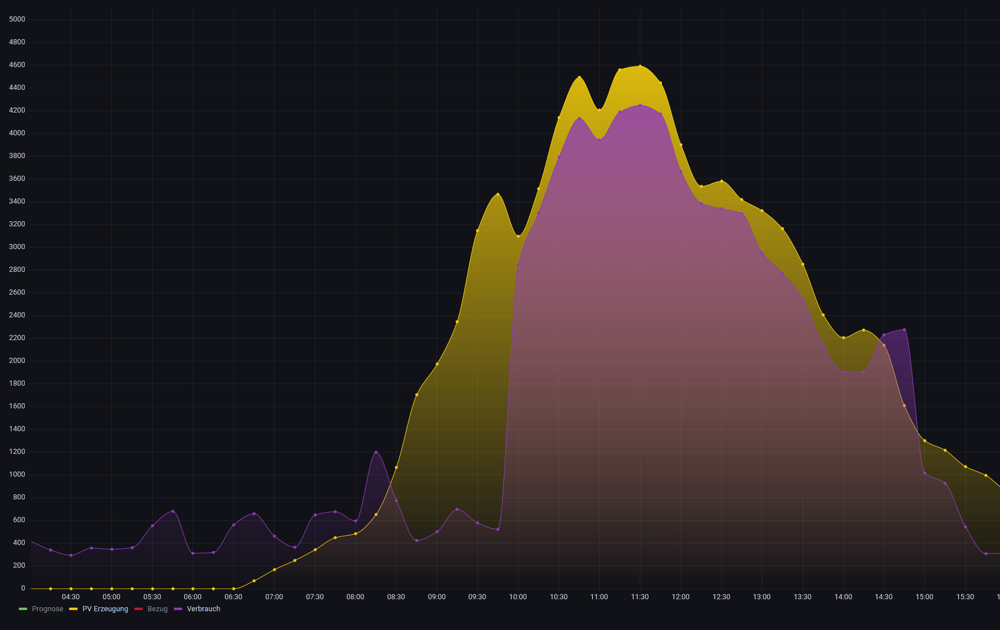

# tesla_pv_charge
Tesla PV charger IOBroker script

For instructions see the script

This script is beta only.

No guarantee if it will work correctly.

I will keep improving it in the future.

One example how the script works.

From 10am it startet charging only from the pv.

The yellow graph is PV energy, the purple graph is the charging power.

